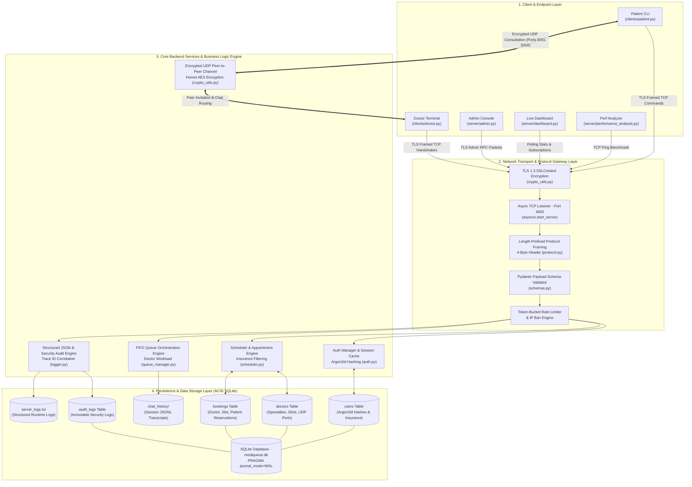

# 🏥 MediQueue Connect

> **A Production-Grade, Multi-Client Healthcare Consultation & Queue Management Platform built over Async TCP and Encrypted UDP Sockets.**

MediQueue Connect simulates a real-life hospital workflow. It enables patients to discover doctors, book appointments based on specialization and insurance, wait in a FIFO queue if the doctor is busy, and establish secure, encrypted live UDP chat consultations. Built with an **asyncio event-driven network core**, **length-prefixed framing protocol**, **Pydantic schema validation**, **Argon2id password hashing**, **transactional SQLite WAL storage**, **structured audit logging**, and an **automated pytest test suite**, MediQueue Connect demonstrates production-grade backend engineering over local socket networks.

---

## 📊 Quick Badges


---

## 📌 Table of Contents

1. [Overview](#-overview)
2. [Detailed System Architecture](#-detailed-system-architecture)
   - [Architecture Diagram](#architecture-diagram)
   - [Layer-by-Layer Architectural Breakdown](#layer-by-layer-architectural-breakdown)
   - [End-to-End Control & Data Flow Pipelines](#end-to-end-control--data-flow-pipelines)
3. [Core Backend & Computer Network Concepts](#-core-backend--computer-network-concepts)
4. [File and Folder Structure](#-file-and-folder-structure)
5. [Installation & Requirements](#-installation--requirements)
6. [Complete Pre-configured Accounts Registry](#-complete-pre-configured-accounts-registry)
7. [Automated Test Suite](#-automated-test-suite)
8. [Step-by-Step Execution Guide](#-step-by-step-execution-guide)
   - [Primary Method: Manual Terminal Execution (Recommended)](#-primary-method-manual-terminal-execution-recommended)
   - [Alternative Method: Automated Launcher Scripts](#-alternative-method-automated-launcher-scripts)
9. [Interactive Walkthrough & Manual Test Scenarios](#-interactive-walkthrough--manual-test-scenarios)
10. [Security Features & Controls](#-security-features--controls)
11. [Troubleshooting & OS Compatibility Notes](#-troubleshooting--os-compatibility-notes)
12. [Future Improvements & Backend Roadmap](#-future-improvements--backend-roadmap)
13. [Contributors](#-contributors)
14. [License](#-license)

---

## ✨ Overview

MediQueue Connect bridges the gap between theoretical computer networking concepts and practical backend software engineering. Developed as a high-performance socket architecture project, this application leverages custom application-layer protocols to orchestrate:

- **Patient Portal**: Profile registration, login, filterable scheduling system based on patient's health insurance eligibility, and real-time appointment booking.
- **Doctor Terminal**: Online/Offline toggle, live consultation channel, and a multi-peer clinical invite system.
- **Queue Orchestration Engine**: FIFO-based waiting room that handles doctor-busy states and automatically notifies queued patients when it is their turn.
- **Secure Chat Layer**: A hybrid messaging channel that negotiates session keys via TCP and routes low-latency, Fernet-encrypted conversation messages over UDP.
- **Admin Command Center**: Database manager allowing admins to delete bookings, audit session transcripts, unban IPs, inspect audit trails, and broadcast system alerts.
- **Live Monitor Dashboard**: Uptime tracking, message/booking statistics counters, and live visualization of doctor workloads, patient queues, and banned IPs.
- **Performance Evaluator**: Side-by-side RTT latency analyzer comparing TCP control traffic against UDP echo streams.

---

## 🏗️ Detailed System Architecture

### Architecture Diagram

The multi-tier system architecture below illustrates the control plane (TLS Async TCP), data plane (Encrypted UDP), gateway validation layers, micro-services, and transactional SQLite storage:



---

### Layer-by-Layer Architectural Breakdown

#### 1. Client & Endpoint Layer
- **Patient CLI (`clients/patient.py`)**: Provides user authentication, profile registration, insurance-based doctor slot discovery, appointment booking, queue cancellation via non-blocking keypress detection (`check_cancel_key`), and Fernet-encrypted UDP consultation chat.
- **Doctor Terminal (`clients/doctor.py`)**: Manages online/offline availability, dequeues patients from FIFO queues (`NEXT_PATIENT`), initiates UDP consultation channels, and handles peer-to-peer doctor collaboration invites (`/invite doctor2`).
- **Admin Console (`server/admin.py`)**: Provides administrative controls for auditing active bookings, executing manual appointment cancellations, unbanning rate-limited IPs, inspecting security audit logs, and broadcasting global alerts.
- **Live Metrics Dashboard (`server/dashboard.py`)**: Subscribes to real-time TCP telemetry streams to visualize server uptime, doctor availability states, patient queue depths, active connections, and server logs.
- **Performance Analyzer (`server/performance_analysis.py`)**: Runs automated benchmark suites comparing TCP control plane latency against low-overhead UDP echo round-trip times (RTT).

#### 2. Network Transport & Protocol Gateway Layer
- **TLS 1.3 Security Context (`crypto_utils.py`)**: Wraps TCP control sockets with self-signed RSA-2048 TLS encryption (`get_server_ssl_context()`), securing control packets against eavesdropping.
- **Async Event-Driven Core (`asyncio`)**: Uses `asyncio.start_server` to process concurrent client socket connections asynchronously without the OS thread context-switching overhead of traditional multi-threaded servers.
- **Length-Prefixed Binary Protocol Framing (`protocol.py`)**: Enforces a 4-byte big-endian header size prefix protocol (`struct.pack(">I", length)`). This guarantees complete message frame reassembly across TCP packet chunk boundaries, preventing buffer fragmentation errors.
- **Pydantic Schema Validator (`schemas.py`)**: Validates every incoming TCP JSON payload against strict Pydantic v2 data models (`LoginPayload`, `RegisterPayload`, `BookPayload`, `RegisterDoctorPayload`) before dispatching requests to core business logic.
- **Token-Bucket Rate Limiter**: Enforces per-IP request frequency limits (`rate=10.0`, `capacity=20.0`). Excess request spikes automatically trigger temporary 5-minute IP bans to defend against socket flooding.

#### 3. Core Backend Services & Business Logic Engine
- **Auth Manager & Session Cache (`auth.py`)**: Manages user registration, credential verification using **Argon2id** password hashing (`argon2-cffi`), legacy SHA-256 hash upgrade migrations, and session token generation (`UUIDv4`).
- **Scheduler & Appointment Engine (`scheduler.py`)**: Filters available slots based on patient health insurance eligibility, manages doctor profile registries, and executes atomic slot reservations in SQLite.
- **FIFO Queue Orchestration Engine (`queue_manager.py`)**: Maintains thread-safe FIFO waiting room queues for busy doctors. When a doctor finishes a consultation, the queue engine automatically notifies the next waiting patient via a `TURN_READY` TCP packet.
- **Encrypted Peer-to-Peer Chat Channel (`crypto_utils.py`)**: Negotiates ephemeral Fernet symmetric session keys over TCP and routes low-latency, encrypted conversation packets over dedicated UDP sockets (`ports 5001-5016`).
- **Structured Logger & Security Audit Engine (`logger.py` & `db.py`)**: Generates structured JSON log records containing timestamp, log level, client IP, and request correlation `trace_id`. Inserts immutable security audit events into SQLite (`audit_logs` table).

#### 4. Persistence & Data Storage Layer (ACID SQLite)
- **Embedded Transactional Database (`data/mediqueue.db`)**: Operates in Write-Ahead Logging (`WAL`) mode with foreign key constraints enabled, providing ACID database guarantees and crash recovery:
  - `users`: Stores usernames, salt-protected Argon2id password hashes, and JSON insurance profiles.
  - `doctors`: Stores doctor names, specializations, accepted insurance lists, UDP ports, and available slots.
  - `bookings`: Transactional appointment reservations with `UNIQUE(doctor, slot)` constraints to prevent double-booking.
  - `audit_logs`: Immutable security audit log table recording user registration, login, appointment creation, cancellation, and admin operations.
- **Session Transcripts (`data/chat_history/`)**: Stores append-only JSONL consultation transcript files per patient-doctor chat session.
- **Server Logs (`data/server_logs.txt`)**: Persistent structured JSON event logs emitted by the Health Server.

---

### End-to-End Control & Data Flow Pipelines

#### Pipeline A: Appointment Booking & Consultation Routing
```text
1. Client -> Gateway : Send 4-byte length-prefixed BOOK command packet over TLS TCP.
2. Gateway -> Schema Validator : Validate payload keys (token, doctor, slot) via Pydantic BookPayload.
3. Schema Validator -> Scheduler : Begin SQLite transaction (BEGIN IMMEDIATE).
4. Scheduler -> SQLite DB : Verify doctor exists and slot is unbooked; INSERT INTO bookings.
5. Scheduler -> Audit Engine : Record BOOK_APPOINTMENT event with correlation trace_id.
6. Server -> Client : Return {"status": "BOOKED", "udp_port": 5001, "specialization": "General Physician"}.
7. Client -> Doctor UDP Port : Negotiate Fernet key & start low-latency encrypted UDP consultation.
```

#### Pipeline B: FIFO Queue Orchestration Flow
```text
1. Client 2 -> Server : Send JOIN_QUEUE command for busy doctor (Doctor 1).
2. Queue Manager -> Client 2 : Return {"status": "QUEUED", "position": 1}.
3. Patient 1 -> Server : End consultation (type 'exit').
4. Server -> Queue Manager : Dequeue Patient 2 from Doctor 1's queue.
5. Server -> Client 2 : Push async TURN_READY TCP packet with Doctor 1's UDP port.
6. Client 2 -> Doctor 1 UDP Port : Auto-connect and start encrypted UDP chat consultation.
```

---

## 🧠 Core Backend & Computer Network Concepts

1. **Async Event-Driven Core (`asyncio`)**:
   - Uses an event-driven `asyncio` loop (`asyncio.start_server`) utilizing OS event multiplexers (`epoll` / `select`) to handle thousands of concurrent socket connections cleanly.
2. **Length-Prefixed Binary Protocol Framing**:
   - Custom 4-byte big-endian header length prefix protocol (`protocol.py`) to prevent TCP stream fragmentation and packet boundary corruption across network chunks.
3. **Transactional SQLite Storage (WAL Mode)**:
   - Embedded SQLite (`mediqueue.db`) operating in Write-Ahead Logging (`WAL`) mode for ACID compliance, concurrent read/write locks, and automatic JSON migration on initial startup.
4. **Argon2id Password Security**:
   - Salt-protected **Argon2id** password hashing (`argon2-cffi`) for state-of-the-art credential storage.
5. **Pydantic Schema Validation**:
   - Incoming TCP RPC payloads are validated against strict **Pydantic v2** models before reaching core business logic.
6. **Graceful Shutdown & Connection Draining**:
   - Traps OS `SIGINT` / `SIGTERM` signals to stop accepting new sockets, notify connected clients with a `SERVER_SHUTDOWN` packet, and flush database transactions and logs cleanly.
7. **Structured Logging & Audit Trails**:
   - Emits structured JSON logs containing timestamp, log level, client IP, and request correlation `trace_id`. Inserts immutable security audit events into SQLite (`audit_logs` table).

---

## 📁 Project Structure

```text
MediQueue-Connect/
│
├── requirements.txt            # Package dependencies (cryptography, pydantic, argon2-cffi, pytest)
├── run_demo.bat                # Windows automated launcher script (--test flag supported)
├── run_demo.sh                 # Linux/macOS automated launcher script (--test flag supported)
├── LICENSE                     # GPLv3 License
├── README.md                   # Project Documentation
│
├── clients/
│   ├── patient.py              # CLI client for patient registration, booking, and UDP chat
│   └── doctor.py               # CLI endpoint for online status updates and UDP consultation
│
├── server/
│   ├── health_server.py        # Central Asyncio TCP server and dispatcher
│   ├── db.py                   # Transactional SQLite manager (WAL mode) & JSON seed engine
│   ├── schemas.py              # Pydantic input validation models for RPC commands
│   ├── protocol.py             # 4-byte length-prefixed binary framing protocol helper
│   ├── auth.py                 # Handles Argon2id hashed authentication & session management
│   ├── scheduler.py            # SQLite-backed appointment manager & slot filter
│   ├── queue_manager.py        # Handles doctor busy states & FIFO queues
│   ├── chat_history.py         # Logs session transcripts to JSONL format
│   ├── crypto_utils.py         # Symmetric Fernet encryption helpers & key exchange
│   ├── logger.py               # Structured JSON logger & audit trail recorder
│   ├── admin.py                # Administrative console with audit log viewer
│   ├── dashboard.py            # Live-updating ANSI terminal dashboard
│   └── performance_analysis.py # Comparative TCP vs UDP latency benchmark utility
│
├── tests/
│   ├── test_db.py              # Unit tests for SQLite storage, Argon2id, and scheduler
│   ├── test_protocol.py        # Unit tests for length-prefixed framing and fallback handling
│   └── test_server_integration.py # Async integration tests for full server lifecycle
│
└── data/
    ├── mediqueue.db            # SQLite database (ACID storage for users, doctors, bookings, audit logs)
    ├── server_logs.txt         # Server runtime structured log file
    ├── chat_history/           # Folder containing audit trails for patient-doctor conversations
    ├── doctors.json            # Legacy seed file for doctors
    ├── users.json              # Legacy seed file for users
    └── bookings.json           # Legacy seed file for bookings
```

---

## ⚡ Installation & Requirements

### Prerequisites
- **Python**: Version 3.10 or higher.
- **Git**: Installed and available in PATH.

### 1) Clone and Prepare Environment

Open your terminal or PowerShell and run:

```bash
# 1. Clone the repository
git clone https://github.com/AishikTokdar/MediQueue-Connect.git
cd MediQueue-Connect

# 2. Create a Python virtual environment
python -m venv .venv

# 3. Activate the virtual environment
# On Windows (PowerShell):
.\.venv\Scripts\Activate.ps1
# On Windows (Command Prompt):
.\.venv\Scripts\activate.bat
# On Linux / macOS:
source .venv/bin/activate

# 4. Install all production dependencies
pip install -r requirements.txt
```

---

## 🔑 Complete Pre-configured Accounts Registry

### Pre-registered Patient Accounts
The default password for all pre-configured accounts is identical to the username:

| Username | Default Password | Registered Insurance | Accessible Specializations |
| :--- | :--- | :--- | :--- |
| `patient1` | `patient1` | `insuranceA` | General Physician, Cardiologist, Dermatologist, Neurologist, Orthopedic, Pediatrician |
| `patient2` | `patient2` | `insuranceB` | General Physician, Cardiologist, Dermatologist, Neurologist, Orthopedic, Pediatrician |
| `patient3` | `patient3` | `insuranceA`, `insuranceB` | All Specializations (Dual Coverage) |
| `patient4` | `patient4` | `insuranceA` | General Physician, Cardiologist, Dermatologist, Neurologist, Orthopedic, Pediatrician |
| `patient5` | `patient5` | `insuranceB` | General Physician, Cardiologist, Dermatologist, Neurologist, Orthopedic, Pediatrician |
| `patient6` | `patient6` | `insuranceA`, `insuranceB` | All Specializations (Dual Coverage) |

---

### Pre-configured Doctor Accounts Registry (`data/mediqueue.db` / `data/doctors.json`)

All doctors accept specific insurance plans and listen on dedicated UDP ports for encrypted consultations:

| Doctor ID | Specialization | Accepted Insurance | UDP Port | Available Slots |
| :--- | :--- | :--- | :--- | :--- |
| `doctor1` | General Physician | `insuranceA`, `insuranceB` | `5001` | `10AM`, `11AM` |
| `doctor5` | General Physician | `insuranceA` | `5005` | `9AM`, `12PM` |
| `doctor6` | General Physician | `insuranceB` | `5006` | `2PM`, `5PM` |
| `doctor2` | Cardiologist | `insuranceB` | `5002` | `12PM`, `1PM` |
| `doctor7` | Cardiologist | `insuranceA` | `5007` | `9AM`, `10AM` |
| `doctor8` | Cardiologist | `insuranceA`, `insuranceB` | `5008` | `2PM`, `3PM`, `4PM` |
| `doctor3` | Dermatologist | `insuranceA` | `5003` | `2PM`, `3PM` |
| `doctor9` | Dermatologist | `insuranceB` | `5009` | `11AM`, `12PM` |
| `doctor10` | Dermatologist | `insuranceA`, `insuranceB` | `5010` | `9AM`, `1PM`, `5PM` |
| `doctor4` | Neurologist | `insuranceA`, `insuranceB` | `5004` | `9AM`, `10AM`, `4PM` |
| `doctor11` | Neurologist | `insuranceA` | `5011` | `10AM`, `11AM` |
| `doctor12` | Neurologist | `insuranceB` | `5012` | `1PM`, `2PM`, `3PM` |
| `doctor13` | Orthopedic | `insuranceA` | `5013` | `9AM`, `11AM` |
| `doctor14` | Orthopedic | `insuranceB` | `5014` | `2PM`, `4PM` |
| `doctor15` | Pediatrician | `insuranceA`, `insuranceB` | `5015` | `10AM`, `1PM`, `3PM` |
| `doctor16` | Pediatrician | `insuranceA` | `5016` | `9AM`, `12PM` |

*Note: You can also register new doctors dynamically at runtime using `python clients/doctor.py`.*

---

## 🧪 Automated Test Suite

Run the automated test suite to confirm all backend components pass on your machine:

```bash
python -m pytest -v tests/
```

---

## ⚡ Step-by-Step Execution Guide

You can run MediQueue Connect using **Manual Step-by-Step Terminal Execution (Recommended)** or via **Automated Launcher Scripts (Alternative helper)**.

---

### 🛠️ Primary Method: Manual Terminal Execution (Recommended)

To understand the client-server interaction and inspect control plane logs directly, launch each component manually in separate terminal windows:

#### Step 1: Start the Health Center Server
Open **Terminal 1** and start the central TLS Async TCP control server:
```bash
python server/health_server.py
```
*Expected Terminal 1 Output:*
```text
[2026-08-25T13:30:00.000] [INFO] TLS SSLContext initialized for server
[2026-08-25T13:30:00.005] [INFO] Health Server running on 127.0.0.1:4000 (Asyncio Core)
```

#### Step 2: Launch Doctor Terminal(s)
Open **Terminal 2** to set `doctor1` online:
```bash
python clients/doctor.py doctor1
```
*Expected Terminal 2 Output:*
```text
=======================================================
  Dr. doctor1  –  General Physician
  UDP port: 5001
=======================================================
  Waiting for patients...
```

*(Optional)* Open **Terminal 3** to set `doctor2` online:
```bash
python clients/doctor.py doctor2
```

#### Step 3: Launch Patient CLI Client
Open **Terminal 4** to launch the interactive patient portal:
```bash
python clients/patient.py
```
*Expected Terminal 4 Interface:*
```text
=======================================================
  MediQueue Connect Patient Portal
=======================================================
1. Login
2. Register
Choose option: 
```

#### Step 4: Launch Live Metrics Dashboard (Optional)
Open **Terminal 5** to view real-time system metrics, doctor busy states, and server logs:
```bash
python server/dashboard.py --interval 2
```

#### Step 5: Launch Admin Console (Optional)
Open **Terminal 6** to execute system admin actions and view immutable audit trails:
```bash
python server/admin.py
```

#### Step 6: Run RTT Latency Analyzer (Optional)
Open **Terminal 7** to benchmark TCP control latency against UDP echo RTT:
```bash
python server/performance_analysis.py --rounds 50 --payload 128
```

---

### 🚀 Alternative Method: Automated Launcher Scripts

If you prefer launching all components automatically in separate background windows with a single command, launcher scripts are provided:

#### On Windows (CMD / PowerShell):
```cmd
run_demo.bat
```
*(Optionally run tests before launching: `run_demo.bat --test`)*

#### On Linux / macOS / WSL:
```bash
chmod +x run_demo.sh
./run_demo.sh
```
*(Optionally run tests before launching: `./run_demo.sh --test`)*

*What the launcher script does automatically:*
1. Starts the Health Server on port `4000` in a new window.
2. Boots `doctor1` (General Physician) on UDP port `5001` in a new window.
3. Boots `doctor2` (Cardiologist) on UDP port `5002` in a new window.
4. Starts the Live Monitoring Dashboard in a new window.
5. Connects your active terminal window directly into the Patient CLI (`clients/patient.py`).

---

## 🧪 Interactive Walkthrough & Manual Test Scenarios

### Scenario 1: Book Appointment & Live Encrypted Chat
1. In **Terminal 4** (Patient CLI):
   - Choose **1. Login** -> Enter `patient1` / `patient1`.
   - Choose **1. Book appointment**.
   - Select specialization **General Physician**.
   - Choose **doctor1** and slot **10AM**.
   - When asked *"Start consultation now?"*, type `y`.
2. Encrypted UDP consultation starts instantly with `doctor1` on port `5001`.
3. Type messages back and forth between Patient and Doctor terminals. Type `exit` in the patient terminal to complete session.

### Scenario 2: FIFO Queue Management
1. Ensure `doctor1` is currently engaged in a chat with Patient 1.
2. Open a new terminal and launch Patient 2: `python clients/patient.py`.
3. Log in as `patient2` / `patient2` and request consultation with `doctor1`.
4. Patient 2 will receive a prompt: `Doctor is busy. You are #1 in the queue.`
5. When Patient 1 finishes and types `exit`, the server automatically notifies Patient 2 (`TURN_READY`) and connects Patient 2 to `doctor1`.

---

## 🔒 Security Features & Controls

- **Argon2id Password Hashing**: Passwords stored using state-of-the-art Argon2id hashing algorithms.
- **Pydantic Schema Guard**: All incoming command payloads validated against Pydantic models.
- **Rate Limiting & Auto-Ban**: Token-bucket algorithm enforcing rate limits per client IP.
- **Audit Logging**: Immutable audit log table recording user registrations, bookings, cancellations, and admin actions.
- **mTLS & TLS Encryption**: Control plane communication encrypted over TLS sockets.
- **Fernet Encrypted UDP Chat**: Dynamic session key derivation for encrypted live chat.

---

## 🚀 Future Improvements & Backend Roadmap

To continue evolving MediQueue Connect into a full-scale distributed microservice backend, the following backend architectural patterns are planned:

### 1. In-Memory Session & Cache Layer (**Redis**)
- **Session Cache**: Offload active session tokens (`self.sessions`) and token revocation lists to **Redis** with auto-expiration (`EXPIRE`).
- **Query Caching**: Cache doctor availability slots and patient profiles in Redis with invalidation hooks on new bookings to reduce SQLite query load.

### 2. Distributed Asynchronous Task Queue (**Celery**)
- **Offloaded Processing**: Move heavy background jobs (session transcript post-processing, PDF medical summary report generation, email/SMS appointment reminders) off the main socket loop into distributed **Celery** workers.

### 3. Enterprise Message Broker & Pub/Sub (**RabbitMQ**)
- **Multi-Node Event Bus**: Replace socket-level in-memory subscriber lists with **RabbitMQ** AMQP exchanges. Enables multi-node Health Server clusters where broadcast alerts, queue status shifts, and doctor availability notifications route across multiple nodes.

### 4. Browser & Mobile Gateway Bridge (**WebSockets / Socket.IO**)
- **Web Client Gateway**: Build a FastAPI / WebSocket proxy gateway (`websockets` / `python-socketio`) translating WebSocket frames into length-prefixed TCP binary packets, allowing web browsers and mobile apps to interact with the backend.

### 5. Microservices Containerization (**Docker & Docker Compose**)
- **Containerized Stack**: Package the Health Server, SQLite DB, Redis cache, Celery workers, and RabbitMQ into isolated containers with a `docker-compose.yml` for single-command stack orchestration (`docker compose up --build`).

### 6. Operational Telemetry & Monitoring (**Prometheus & Grafana**)
- **Metrics Exporter**: Expose a `/metrics` Prometheus endpoint tracking active socket connections, queue depth per doctor, latency histograms (p50/p95/p99 RTT), error rates, and DB pool metrics paired with a custom Grafana dashboard.

---

## 🛠️ Implemented Architectural Features Status

1. **Cross-Platform Queue Management** *(Implemented ✓)*
2. **TLS/SSL for TCP Socket Communication** *(Implemented ✓)*
3. **Dynamic Doctor Registration** *(Implemented ✓)*
4. **Persistent Database Integration (SQLite WAL)** *(Implemented ✓)*
5. **Length-Prefixed Protocol Framing** *(Implemented ✓)*
6. **Pydantic Input Validation & Argon2id Auth** *(Implemented ✓)*
7. **Automated Pytest Integration Test Suite** *(Implemented ✓)*
8. **Redis Cache & Session Storage** *(Roadmap)*
9. **Celery Task Queue & RabbitMQ Broker** *(Roadmap)*
10. **WebSocket Gateway & Docker Compose Setup** *(Roadmap)*
11. **Prometheus Telemetry & Metrics Exporter** *(Roadmap)*

---

## 🙌 Contributors

- [Aishik Tokdar](https://github.com/AishikTokdar)
- [Shataghnee Chatterjee](https://github.com/shataghnee05)
- [Dipyaman Chakraborty](https://github.com/dipyamanchakraborty)

---

## 📜 License

This project is licensed under the **GNU General Public License v3.0 (GPL-3.0)**. See the `LICENSE` file for details.
