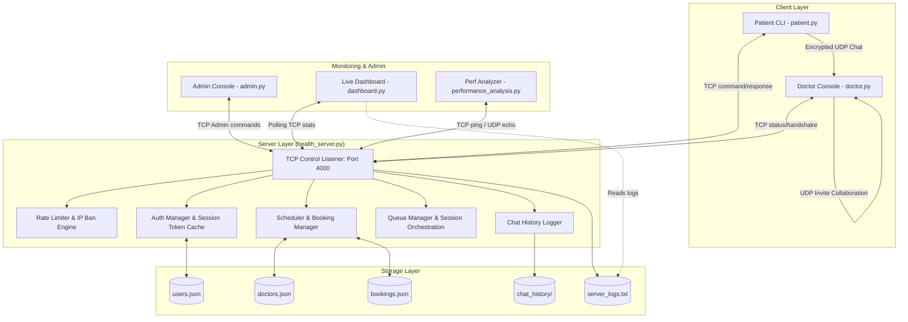

# 🏥 MediQueue Connect

> **A Secure, Multi-Client Healthcare Consultation & Queue Management Platform built over TCP and UDP Sockets.**

MediQueue Connect simulates a real-life hospital workflow. It enables patients to discover doctors, book appointments based on specialization and insurance, wait in a FIFO queue if the doctor is busy, and establish secure, encrypted live UDP chat consultations. An integrated Admin Console, Live Metrics Dashboard, and Performance Benchmarking tool provide a full-fledged demonstration of network concepts.

---

## 📊 Quick Badges


%20%7C%20Linux%20(Limited)-success?style=for-the-badge&logo=windows&logoColor=white)


---

## 📌 Table of Contents

1. [Overview](#-overview)
2. [System Architecture](#-system-architecture)
3. [Core Computer Network Concepts Used](#-core-computer-network-concepts-used)
4. [File and Folder Structure](#-file-and-folder-structure)
5. [Installation & Requirements](#-installation--requirements)
6. [Pre-configured Accounts (For Testing)](#-pre-configured-accounts-for-testing)
7. [Step-by-Step Run Guide](#-step-by-step-run-guide)
8. [Feature Tour & Interactive Demos](#-feature-tour--interactive-demos)
9. [Security Features & Controls](#-security-features--controls)
10. [Troubleshooting & OS Compatibility Notes](#-troubleshooting--os-compatibility-notes)
11. [Future Improvements](#-future-improvements)
12. [Contributors](#-contributors)
13. [License](#-license)

---

## ✨ Overview

MediQueue Connect bridges the gap between theoretical computer networking concepts and practical software engineering. Developed as part of the **Computer Communication and Networks (CCN/CN) curriculum**, this multi-threaded application leverages custom client-server application-layer protocols to orchestrate:

- **Patient Portal**: Profile registration, login, filterable scheduling system based on patient's health insurance eligibility, and real-time appointment booking.
- **Doctor Terminal**: Online/Offline toggle, live consultation channel, and a multi-peer clinical invite system.
- **Queue Orchestration Engine**: FIFO-based waiting room that handles doctor-busy states, and automatically notifies queued patients when it is their turn.
- **Secure Chat Layer**: A hybrid messaging channel that negotiates session keys via TCP and routes low-latency, Fernet-encrypted conversation messages over UDP.
- **Admin Command Center**: Database manager allowing admins to delete bookings, audit session transcripts, unban IPs, and broadcast messages to all connected entities.
- **Live Monitor Dashboard**: Uptime tracking, message/booking statistics counters, and live visualization of doctor workloads, patient queues, and banned IPs.
- **Performance Evaluator**: Side-by-side RTT latency analyzer comparing TCP control traffic against UDP echo streams.

---

## 🏗️ System Architecture

The following diagram illustrates how the core components communicate using TCP, UDP, local JSON datastores, and the publish-subscribe model:



---

## 🧠 Core Computer Network Concepts Used

MediQueue Connect is a sandbox for demonstrating several primary networking paradigms:

1. **Transport Protocol Selection**:
   - **TCP (Transmission Control Protocol)** is utilized for session establishment, authentication, slot scheduling, administrative tasks, and pub-sub notifications where data integrity and in-order delivery are non-negotiable.
   - **UDP (User Datagram Protocol)** is used for actual chat messaging and doctor-to-doctor invitations. Because UDP avoids connection overhead, it offers low latency suited for real-time interaction.
2. **Application-Layer Custom Protocol**:
   - Communication between the client and server relies on a custom newline-delimited (`\n`) JSON message exchange protocol. This defines clear primitives for actions like `LOGIN`, `BOOK_SLOT`, `REQUEST_CHAT`, `END_SESSION`, and `ADMIN_GLOBAL_MSG`.
3. **Multi-Threaded Concurrency**:
   - The Health Server maintains a connection thread pool (`threading.Thread`) to concurrently handle multiple incoming client requests.
   - Separate daemon threads are used on clients to handle real-time server push events (broadcasts, session termination) without freezing the main CLI interface.
4. **Publish-Subscribe Pattern**:
   - Clients invoke a persistent `SUBSCRIBE` command. The server holds these open connections in an active subscriber list. If the admin broadcasts a global message or terminates a session, the server pushes the payload down all subscriber sockets instantly.
5. **Stateful Session Management**:
   - Transient UUID session tokens are generated upon successful login. These tokens validate subsequent actions, maintaining state across disconnected TCP transactions without requiring credentials to be re-transmitted.
6. **Rate Limiting & DDoS Prevention**:
   - A token-bucket algorithm monitors incoming IP addresses. Request frequency exceeding defined thresholds triggers a temporary 5-minute IP ban, simulating firewalls and intrusion prevention systems.

---

## 📁 Project Structure

```text
MediQueue-Connect/
│
├── requirements.txt            # Package dependencies (cryptography)
├── LICENSE                     # GPLv3 License
├── README.md                   # Project Documentation
│
├── clients/
│   ├── patient.py              # CLI client for patient registration, booking, and UDP chat
│   └── doctor.py               # CLI endpoint for online status updates and UDP consultation
│
├── server/
│   ├── health_server.py        # Central TCP socket server and dispatcher
│   ├── auth.py                 # Handles SHA-256 hashed password storage & authentication
│   ├── scheduler.py            # Manages appointments and filters slots by insurance
│   ├── queue_manager.py        # Handles doctor busy states & FIFO queues
│   ├── chat_history.py         # Logs session transcripts to JSONL format
│   ├── crypto_utils.py         # Symmetric Fernet encryption helpers & key exchange
│   ├── logger.py               # Thread-safe file/console logging
│   ├── admin.py                # Command-line interface for administrative operations
│   ├── dashboard.py            # Live-updating ANSI terminal dashboard
│   └── performance_analysis.py # Comparative TCP vs UDP latency benchmark utility
│
└── data/
    ├── doctors.json            # Hardcoded registry of doctor attributes, ports, and specialties
    ├── users.json              # Hashed credentials database
    ├── bookings.json           # Active appointment reservations
    ├── server_logs.txt         # Server runtime event log
    └── chat_history/           # Folder containing audit trails for patient-doctor conversations
```

---

## ⚡ Installation & Requirements

### Dependencies
- **Python**: Version 3.10 or higher.
- **Cryptography**: Required for encrypted consultations (`pip install cryptography`).

### 1) Clone and Prepare Environment

Open your terminal or PowerShell and run:

```bash
# Clone the repository
git clone https://github.com/AishikTokdar/MediQueue-Connect.git
cd MediQueue-Connect

# Create a virtual environment
python -m venv .venv

# Activate the virtual environment
# On Windows (PowerShell):
.\.venv\Scripts\Activate.ps1
# On Windows (CMD):
.\.venv\Scripts\activate.bat
# On Linux / macOS:
source .venv/bin/activate

# Install required packages
pip install -r requirements.txt
```

---

## 🔑 Pre-configured Accounts (For Testing)

To log in immediately, use any of the pre-configured patients. The default password is identical to the username:

| Username | Default Password | Specializations Allowed | Pre-registered Insurance |
| :--- | :--- | :--- | :--- |
| `patient1` | `patient1` | General, Cardiologist, Dermatologist, Neurologist | `insuranceA` |
| `patient2` | `patient2` | General, Cardiologist, Dermatologist, Neurologist | `insuranceB` |
| `patient3` | `patient3` | General, Cardiologist, Dermatologist, Neurologist | `insuranceA`, `insuranceB` |
| `patient4` | `patient4` | General, Cardiologist, Dermatologist, Neurologist | `insuranceA` |
| `patient5` | `patient5` | General, Cardiologist, Dermatologist, Neurologist | `insuranceB` |
| `patient6` | `patient6` | General, Cardiologist, Dermatologist, Neurologist | `insuranceA`, `insuranceB` |

*Note: You can also create new users using the registration menu inside `patient.py`.*

---

## 🚀 Step-by-Step Run Guide

To run a full simulation of the system, open **multiple terminal windows** and execute the commands in the order listed below.

### 1. Start the Health Server
First, start the central server that handles all requests, queue logic, and bookings:
```bash
python server/health_server.py
```
*Expected console output: `=== Health Center Server started on 127.0.0.1:4000 ===`*

### 2. Launch the Doctors
Start one or more doctor clients to register them as online:
```bash
# Terminal A
python clients/doctor.py doctor1

# Terminal B (Optional, for multi-doctor demo)
python clients/doctor.py doctor2
```
*Expected output: Displays specialization, UDP port, and prints `Waiting for patients...`*

### 3. Launch Patient Clients
Open patient terminals to book appointments or initiate live consultations:
```bash
# Terminal C (Patient 1)
python clients/patient.py

# Terminal D (Patient 2)
python clients/patient.py
```

### 4. Monitor the System (Optional)
Run the monitoring dashboard to observe active status, queues, and uptime:
```bash
python server/dashboard.py --interval 2
```

### 5. Run the Admin Console (Optional)
Manage database bookings, read conversation logs, or unban rate-limited clients:
```bash
python server/admin.py
```

### 6. Run the Network Benchmarking Tool (Optional)
Analyze latency differences between TCP and UDP:
```bash
python server/performance_analysis.py --rounds 50 --payload 128
```

---

## 🛠️ Feature Tour & Interactive Demos

### 1. Booking a Slot & Patient Scheduling
1. Run `patient.py` and log in as `patient1` (password: `patient1`).
2. Choose **Option 1: Book appointment**.
3. Select a specialization (e.g., *General Physician*) or type `0` to list all doctors.
4. The patient client will list only doctors who accept `insuranceA` (matching `patient1`'s profile).
5. Select a doctor (e.g. `doctor1`) and type an available slot (e.g., `10AM`).
6. Confirm booking. The client will query if you want to chat now. Choosing `yes` immediately launches the consultation routing.

### 2. Real-time Queue Orchestration
If a doctor is already consulting a patient, other incoming patients are placed in a queue:
1. Ensure `doctor1` is online.
2. Start Patient Terminal A (`patient1`), start a chat with `doctor1`. An active UDP chat begins.
3. Start Patient Terminal B (`patient2`), attempt to chat with `doctor1`.
4. Patient B will receive a message: `Doctor is busy. You are #1 in the queue.`
5. On Patient Terminal B, you will see a waiting screen. Pressing `c` sends a `CANCEL_QUEUE` packet to exit.
6. When Patient A types `exit`, the chat session ends.
7. The server automatically processes the queue, sends a `TURN_READY` TCP packet to Patient B, and connects Patient B to `doctor1`'s UDP socket automatically.

### 3. Consultation Layer (Encrypted vs Plaintext)
- **If `cryptography` is installed**:
  - Upon starting a UDP session, the doctor client generates an ephemeral Fernet key.
  - The doctor client encrypts this session key using a shared secret passphrase (`HealthcareCN2024SecretPassphrase!`) and sends it to the patient.
  - The patient client decrypts the session key. All subsequent conversation messages (`type: CHAT`) are sent as ciphertext.
  - The Patient terminal displays a `🔒 Encrypted chat with Dr. <name> started` banner.
- **If `cryptography` is NOT installed**:
  - The handshake falls back to plaintext.
  - Sockets transmit raw text, and the patient terminal displays a `⚠ Plaintext chat with Dr. <name> started` warning.

### 4. Doctor-to-Doctor Invite Feature (Collaboration)
While engaged in a live chat, doctors can invite offline/online colleagues for a joint consultation:
1. During an active chat with a patient, the doctor can type:
   ```text
   /invite doctor2
   ```
2. If the second doctor is online (on their designated port), they receive the invitation packet and join the active chat session.
3. Messages are broadcasted across all participating endpoints.

### 5. Admin global controls
Using `admin.py`:
- **Global Broadcast**: Select **Option 4** and type a message. All connected doctors and patients will instantly receive a highlighted server broadcast alert in their consoles.
- **Kill Session**: Select **Option 3**, view active sessions, and type `kill <session_number>`. The server will transmit a termination packet to the subscriber thread of both patient and doctor, ending the consultation immediately.

---

## 🔒 Security Features & Controls

MediQueue Connect includes basic security features suited for simulated and educational network environments:

### Rate Limiting & Auto-Ban
- Prevents socket flooding (denial of service).
- Configured in `server/health_server.py` via `RateLimiter`:
  - **Bucket capacity**: 20 tokens.
  - **Refill rate**: 10 tokens per second.
  - **Ban duration**: 300 seconds (5 minutes).
- Triggering the rate limit returns a `BANNED: Rate limit exceeded` JSON response and ignores subsequent packets from that IP.

### Password Hashing
- Client passwords are never stored in plaintext.
- Passwords are submitted to the server, hashed using SHA-256 with `hashlib`, and compared against the values stored in `data/users.json`.

---

## 🩺 Troubleshooting & OS Compatibility Notes

### ⚠️ Windows Console Colors
If ANSI escape sequences (like `\033[91m`) appear as raw characters in Windows Command Prompt, run the script once to enable virtual terminal processing, or use Windows Terminal (PowerShell).

### ⚠️ OS Compatibility (Windows vs. Linux)
> [!IMPORTANT]
> The patient client (`clients/patient.py`) uses Python's Windows-only `msvcrt` module to detect input when waiting in the queue.
> If a patient client is run on **Linux or macOS**, it will execute correctly until they enter a busy queue. At that point, the script will raise an `ImportError` because `msvcrt` is unavailable.
> 
> *Workaround for Linux/macOS users: Avoid entering busy queues during testing, or run the client on a Windows host.*

### ⚠️ Udp Port Conflicts
Each doctor operates on a dedicated UDP port defined in `data/doctors.json` (ranging from `5001` to `5012`). If you receive a socket bind error, verify that no other process is using those ports:
- On Windows: `netstat -ano | findstr <port>`
- On Linux: `sudo lsof -i :<port>`

---

## 🚀 Future Improvements

To transition MediQueue Connect from an educational simulation to a production-grade application, several architectural improvements could be made:

1. **Cross-Platform Queue Management**:
   Replace the Windows-only `msvcrt` module in the queue loop with a multi-threaded non-blocking queue reader (e.g., using `select.select` or a separate input reader thread). This would make the patient client fully compatible with Linux and macOS.
2. **TLS/SSL for TCP Socket Communication**:
   Wrap the main TCP server socket using Python's `ssl` library. This would prevent credentials and session tokens from being sent in plaintext across the network, securing them against packet sniffing.
3. **True Diffie-Hellman Key Exchange (DHKE)**:
   Implement an actual Diffie-Hellman or Elliptic Curve Diffie-Hellman (ECDH) key exchange protocol at the start of UDP sessions. This would allow patients and doctors to generate a shared session key without relying on a hardcoded passphrase (`HealthcareCN2024SecretPassphrase!`).
4. **Dynamic Doctor Registration**:
   Transition doctor configurations out of static JSON files. Allow doctors to register dynamically with the Health Server upon booting, specifying their specialization, availability, and preferred listening ports.
5. **Persistent Database Integration**:
   Replace local JSON storage (`users.json`, `bookings.json`) with an ACID-compliant database like SQLite or PostgreSQL. This would resolve potential file-lock conflicts caused by concurrent read/write operations.
6. **Real-time Audio/Video Streaming (RTP/RTCP)**:
   Extend the consultation layer to support voice and video by packetizing microphone/camera streams and transmitting them over UDP, managed by a session signaling protocol.

---

## 🙌 Contributors

- [Aishik Tokdar](https://github.com/AishikTokdar)
- [Shataghnee Chatterjee](https://github.com/shataghnee05)
- [Dipyaman Chakraborty](https://github.com/dipyamanchakraborty)

---

## 📜 License

This project is licensed under the **GNU General Public License v3.0 (GPL-3.0)**. See the `LICENSE` file for details.
