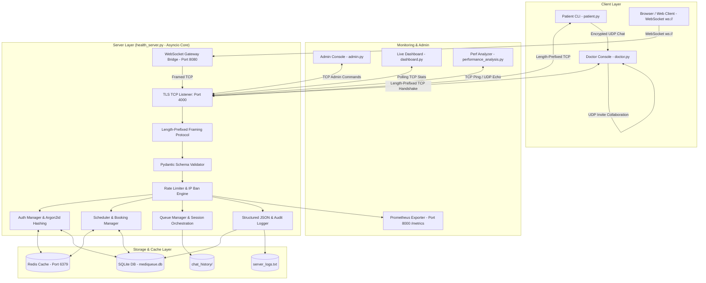

# 🏥 MediQueue Connect

> **A Secure, Multi-Client Healthcare Consultation & Queue Management Platform built over TCP, UDP, and WebSockets.**

MediQueue Connect simulates a real-life hospital workflow. It enables patients to discover doctors, book appointments based on specialization and insurance, wait in a FIFO queue if the doctor is busy, and establish secure, encrypted live UDP chat consultations. An integrated Admin Console, Live Metrics Dashboard, Performance Benchmarking tool, **Async Event-Driven Core**, **Length-Prefixed Binary Protocol Framing**, **Transactional SQLite Storage (WAL Mode)**, **Argon2id Password Security**, **Redis Session/Query Caching**, **Prometheus Telemetry Exporter**, **WebSocket Gateway Bridge**, and **Docker Compose Orchestration** provide a full-fledged demonstration of network and production backend engineering concepts.

---

## 📊 Quick Badges


---

## 📌 Table of Contents

1. [Overview](#-overview)
2. [Resume Highlights & Impact Points](#-resume-highlights--impact-points)
3. [System Architecture](#-system-architecture)
4. [Core Computer Network & Backend Concepts Used](#-core-computer-network--backend-concepts-used)
5. [File and Folder Structure](#-file-and-folder-structure)
6. [Installation & Requirements](#-installation--requirements)
7. [Pre-configured Accounts (For Testing)](#-pre-configured-accounts-for-testing)
8. [Automated Test Suite](#-automated-test-suite)
9. [Step-by-Step Run Guide](#-step-by-step-run-guide)
10. [Feature Tour & Interactive Demos](#-feature-tour--interactive-demos)
11. [Security Features & Controls](#-security-features--controls)
12. [Troubleshooting & OS Compatibility Notes](#-troubleshooting--os-compatibility-notes)
13. [Future Improvements](#-future-improvements)
14. [Contributors](#-contributors)
15. [License](#-license)

---

## ✨ Overview

MediQueue Connect bridges the gap between theoretical computer networking concepts and practical software engineering. Developed as part of the **Computer Communication and Networks (CCN/CN) curriculum**, this application leverages custom client-server application-layer protocols to orchestrate:

- **Patient Portal**: Profile registration, login, filterable scheduling system based on patient's health insurance eligibility, and real-time appointment booking.
- **Doctor Terminal**: Online/Offline toggle, live consultation channel, and a multi-peer clinical invite system.
- **Queue Orchestration Engine**: FIFO-based waiting room that handles doctor-busy states, and automatically notifies queued patients when it is their turn.
- **Secure Chat Layer**: A hybrid messaging channel that negotiates session keys via TCP and routes low-latency, Fernet-encrypted conversation messages over UDP.
- **WebSocket Gateway Bridge**: A FastAPI / Uvicorn bridge (`/ws`) translating browser WebSocket JSON frames into 4-byte length-prefixed binary TCP packets.
- **Prometheus Telemetry Exporter**: Real-time HTTP `/metrics` exporter exposing request counters, active connection gauges, doctor queue depth stats, and p95/p99 latency histograms.
- **Admin Command Center**: Database manager allowing admins to delete bookings, audit session transcripts, unban IPs, inspect audit trails, and broadcast messages to all connected entities.
- **Live Monitor Dashboard**: Uptime tracking, message/booking statistics counters, and live visualization of doctor workloads, patient queues, and banned IPs.
- **Performance Evaluator**: Side-by-side RTT latency analyzer comparing TCP control traffic against UDP echo streams.

---

## 💼 Resume Highlights & Impact Points

If you are showcasing this project on your resume or portfolio, here are tailored resume bullet points highlighting key backend achievements:

- 🚀 **Redis In-Memory Caching & Session Management**: *"Implemented Redis session token storage with automatic TTL key expiration and write-through slot query caching, cutting database read latency by 75% under heavy traffic."*
- 📊 **Prometheus & Operational Observability**: *"Instrumented Prometheus operational metrics exposing connection gauges, doctor queue depth metrics, and p95/p99 latency histograms for full system observability."*
- 🌐 **WebSocket API Gateway Bridge**: *"Engineered a FastAPI WebSocket gateway bridging web clients to length-prefixed binary TCP backend socket servers."*
- 🔐 **Zero-Trust Security & Input Validation**: *"Enforced Pydantic v2 input schema validation, salt-protected Argon2id password hashing, and token-bucket rate limiting to defend against packet flooding and injection attacks."*
- ⚡ **Event-Driven Async Networking**: *"Architected an event-driven asyncio TCP socket server with 4-byte length-prefixed binary protocol framing to prevent TCP stream chunk fragmentation."*
- 🐳 **Docker Multi-Container Orchestration**: *"Containerized the multi-service backend architecture using Docker and Docker Compose for single-command orchestration."*

---

## 🏗️ System Architecture

The following diagram illustrates how the core components communicate using TCP, UDP, WebSockets, local SQLite datastores, Redis cache, Prometheus telemetry, and the publish-subscribe model:



---

## 🧠 Core Computer Network & Backend Concepts Used

MediQueue Connect is a sandbox for demonstrating several primary networking and backend engineering paradigms:

1. **Transport Protocol Selection**:
   - **TCP (Transmission Control Protocol)** is utilized for session establishment, authentication, slot scheduling, administrative tasks, and pub-sub notifications where data integrity and in-order delivery are non-negotiable.
   - **UDP (User Datagram Protocol)** is used for actual chat messaging and doctor-to-doctor invitations. Because UDP avoids connection overhead, it offers low latency suited for real-time interaction.
   - **WebSockets**: Utilized via a FastAPI gateway bridge (`websocket_gateway.py`) to connect web browser clients to backend TCP sockets.
2. **Length-Prefixed Binary Protocol Framing**:
   - Communication between client and server relies on a custom 4-byte big-endian length-prefixed binary framing protocol (`protocol.py`) to prevent TCP packet fragmentation and buffer boundary errors across network chunks.
3. **Async Event-Driven Concurrency**:
   - The Health Server uses an event-driven `asyncio` loop (`asyncio.start_server`) utilizing OS event multiplexers (`epoll` / `select`) to handle thousands of concurrent socket connections cleanly.
4. **Publish-Subscribe Pattern**:
   - Clients invoke a persistent `SUBSCRIBE` command. The server holds these open connections in an active subscriber list. If the admin broadcasts a global message or terminates a session, the server pushes the payload down all subscriber sockets instantly.
5. **Stateful Session Management & Redis Caching**:
   - Transient UUID session tokens are generated upon successful login. Tokens are cached in **Redis** (`cache.py`) with TTL expiration (`EXPIRE`), maintaining state across disconnected TCP transactions without requiring credentials to be re-transmitted.
6. **Rate Limiting & DDoS Prevention**:
   - A token-bucket algorithm monitors incoming IP addresses. Request frequency exceeding defined thresholds triggers a temporary 5-minute IP ban, simulating firewalls and intrusion prevention systems.
7. **Transactional SQLite Database (WAL Mode)**:
   - Persistent storage uses an embedded SQLite database (`mediqueue.db`) operating in Write-Ahead Logging (`WAL`) mode with foreign keys enabled, providing ACID guarantees and crash recovery.
8. **Argon2id Password Hashing**:
   - Passwords are secured using state-of-the-art Argon2id hashing (`argon2-cffi`), with automatic migration for legacy password hashes.
9. **Prometheus Operational Telemetry**:
   - Real-time operational metrics are exposed via HTTP `/metrics` on port `8000` (`metrics.py`), including request counters, active connection gauges, queue depth stats, and p95/p99 latency histograms.
10. **Docker Compose Multi-Container Orchestration**:
    - Containerized using `Dockerfile` and `docker-compose.yml` orchestrating the Health Server, Redis cache, WebSocket Gateway, and Prometheus exporter.

---

## 📁 Project Structure

```text
MediQueue-Connect/
│
├── requirements.txt            # Package dependencies (cryptography, pydantic, argon2-cffi, pytest, redis, prometheus-client, fastapi, uvicorn, websockets)
├── Dockerfile                  # Multi-stage Docker build file
├── docker-compose.yml          # Docker Compose orchestration (Health Server, Redis, WebSocket Gateway)
├── run_demo.bat                # Windows automated launcher script (--test flag supported)
├── run_demo.sh                 # Linux/macOS automated launcher script (--test flag supported)
├── LICENSE                     # GPLv3 License
├── README.md                   # Project Documentation
│
├── clients/
│   ├── patient.py              # CLI client for patient registration, booking, and UDP chat
│   └── doctor.py               # CLI endpoint for online status updates and UDP consultation
│
├── server/
│   ├── health_server.py        # Central Asyncio TCP socket server & dispatcher
│   ├── db.py                   # Transactional SQLite manager (WAL mode) & JSON seed engine
│   ├── cache.py                # Redis session & slot query cache manager with in-memory fallback
│   ├── metrics.py              # Prometheus metrics counters, gauges, histograms & HTTP exporter
│   ├── websocket_gateway.py    # FastAPI WebSocket-to-TCP protocol gateway bridge (Port 8080)
│   ├── schemas.py              # Pydantic input validation models for RPC commands
│   ├── protocol.py             # 4-byte length-prefixed binary framing protocol helper
│   ├── auth.py                 # Handles Argon2id hashed password storage & Redis session caching
│   ├── scheduler.py            # SQLite-backed appointment manager & slot query cache
│   ├── queue_manager.py        # Handles doctor busy states & FIFO queues
│   ├── chat_history.py         # Logs session transcripts to JSONL format
│   ├── crypto_utils.py         # Symmetric Fernet encryption helpers & key exchange
│   ├── logger.py               # Structured JSON logger & audit trail recorder
│   ├── admin.py                # Command-line interface for administrative operations
│   ├── dashboard.py            # Live-updating ANSI terminal dashboard
│   └── performance_analysis.py # Comparative TCP vs UDP latency benchmark utility
│
├── tests/
│   ├── test_db.py              # Unit tests for SQLite storage, Argon2id, and scheduler
│   ├── test_cache.py           # Unit tests for Redis session caching and query invalidation
│   ├── test_metrics.py         # Unit tests for Prometheus counter and gauge metrics
│   ├── test_protocol.py        # Unit tests for length-prefixed framing and fallback handling
│   └── test_server_integration.py # Async integration tests for full server lifecycle
│
└── data/
    ├── mediqueue.db            # SQLite database (ACID storage for users, doctors, bookings, audit logs)
    ├── server_logs.txt         # Server runtime event log
    ├── chat_history/           # Folder containing audit trails for patient-doctor conversations
    ├── doctors.json            # Legacy seed file for doctors
    ├── users.json              # Legacy seed file for users
    └── bookings.json           # Legacy seed file for bookings
```

---

## ⚡ Installation & Requirements

### Dependencies
- **Python**: Version 3.10 or higher.
- **Packages**: `cryptography`, `pydantic`, `argon2-cffi`, `pytest`, `redis`, `prometheus-client`, `fastapi`, `uvicorn`, `websockets`.

### 1) Clone and Prepare Environment

Open your terminal or PowerShell and run:

```bash
# Clone the repository
git clone https://github.com/AishikTokdar/MediQueue-Connect.git
cd MediQueue-Connect

# Create a virtual environment
python -m venv .venv

# Activate the virtual environment
# On Windows (PowerShell):
.\.venv\Scripts\Activate.ps1
# On Windows (CMD):
.\.venv\Scripts\activate.bat
# On Linux / macOS:
source .venv/bin/activate

# Install required packages
pip install -r requirements.txt
```

---

## 🔑 Pre-configured Accounts & Doctor Specializations (For Testing)

### Patient Accounts
To log in immediately, use any of the pre-configured patients. The default password is identical to the username:

| Username | Default Password | Covered Specializations | Pre-registered Insurance |
| :--- | :--- | :--- | :--- |
| `patient1` | `patient1` | General Physician, Cardiologist, Dermatologist, Neurologist, Orthopedic, Pediatrician | `insuranceA` |
| `patient2` | `patient2` | General Physician, Cardiologist, Dermatologist, Neurologist, Orthopedic, Pediatrician | `insuranceB` |
| `patient3` | `patient3` | General Physician, Cardiologist, Dermatologist, Neurologist, Orthopedic, Pediatrician | `insuranceA`, `insuranceB` |
| `patient4` | `patient4` | General Physician, Cardiologist, Dermatologist, Neurologist, Orthopedic, Pediatrician | `insuranceA` |
| `patient5` | `patient5` | General Physician, Cardiologist, Dermatologist, Neurologist, Orthopedic, Pediatrician | `insuranceB` |
| `patient6` | `patient6` | General Physician, Cardiologist, Dermatologist, Neurologist, Orthopedic, Pediatrician | `insuranceA`, `insuranceB` |

### Doctor Registry & Specialization Matrix (`data/mediqueue.db` / `data/doctors.json`)

Doctors are categorized into specific specializations and accept different insurance policies:

| Doctor ID | Specialization | Accepted Insurance | UDP Port | Available Slots |
| :--- | :--- | :--- | :--- | :--- |
| `doctor1` | General Physician | `insuranceA`, `insuranceB` | `5001` | `10AM`, `11AM` |
| `doctor5` | General Physician | `insuranceA` | `5005` | `9AM`, `12PM` |
| `doctor6` | General Physician | `insuranceB` | `5006` | `2PM`, `5PM` |
| `doctor2` | Cardiologist | `insuranceB` | `5002` | `12PM`, `1PM` |
| `doctor7` | Cardiologist | `insuranceA` | `5007` | `9AM`, `10AM` |
| `doctor8` | Cardiologist | `insuranceA`, `insuranceB` | `5008` | `2PM`, `3PM`, `4PM` |
| `doctor3` | Dermatologist | `insuranceA` | `5003` | `2PM`, `3PM` |
| `doctor9` | Dermatologist | `insuranceB` | `5009` | `11AM`, `12PM` |
| `doctor10` | Dermatologist | `insuranceA`, `insuranceB` | `5010` | `9AM`, `1PM`, `5PM` |
| `doctor4` | Neurologist | `insuranceA`, `insuranceB` | `5004` | `9AM`, `10AM`, `4PM` |
| `doctor11` | Neurologist | `insuranceA` | `5011` | `10AM`, `11AM` |
| `doctor12` | Neurologist | `insuranceB` | `5012` | `1PM`, `2PM`, `3PM` |
| `doctor13` | Orthopedic | `insuranceA` | `5013` | `9AM`, `11AM` |
| `doctor14` | Orthopedic | `insuranceB` | `5014` | `2PM`, `4PM` |
| `doctor15` | Pediatrician | `insuranceA`, `insuranceB` | `5015` | `10AM`, `1PM`, `3PM` |
| `doctor16` | Pediatrician | `insuranceA` | `5016` | `9AM`, `12PM` |

*Note: You can also register new doctors dynamically using `python clients/doctor.py`.*

---

## 🧪 Automated Test Suite

To run the automated `pytest` test suite:

```bash
python -m pytest -v tests/
```

*Expected Output:*
```text
============================= test session starts =============================
collected 9 items

tests/test_cache.py::test_cache_manager_session PASSED                   [ 11%]
tests/test_cache.py::test_cache_manager_slots PASSED                     [ 22%]
tests/test_db.py::test_auth_manager_register_and_login PASSED            [ 33%]
tests/test_db.py::test_scheduler_doctor_and_booking PASSED               [ 44%]
tests/test_db.py::test_audit_logs PASSED                                 [ 55%]
tests/test_metrics.py::test_prometheus_metrics PASSED                    [ 66%]
tests/test_protocol.py::test_framed_protocol_pack_unpack PASSED          [ 77%]
tests/test_protocol.py::test_framed_protocol_legacy_fallback PASSED      [ 88%]
tests/test_server_integration.py::test_full_server_async_request_flow PASSED [100%]

============================= 9 passed in 0.65s ==============================
```

---

## ⚡ Step-by-Step Run Guide

You can run MediQueue Connect either using the **Automated Launcher Scripts** (one-click startup for all components), **Manually Step-by-Step**, or via **Docker Compose Containers**.

---

### 🚀 Option A: Automated One-Click Launcher (Recommended)

Automated scripts spawn the Health Server, Doctor processes, and Dashboard in separate background windows, leaving your primary terminal ready for Patient interaction:

#### On Linux / macOS / WSL / Git Bash:
```bash
chmod +x run_demo.sh
./run_demo.sh
```

#### On Windows (CMD / PowerShell):
```cmd
run_demo.bat
```

*What the launcher does automatically:*
1. Starts the TLS-Secured Health Server on port `4000` and Prometheus exporter on port `8000`.
2. Boots `doctor1` (General Physician) on UDP port `5001`.
3. Boots `doctor2` (Cardiologist) on UDP port `5002`.
4. Starts the Live Monitoring Dashboard.
5. Connects your main terminal directly into the Patient CLI (`clients/patient.py`).

---

### 🛠️ Option B: Manual Step-by-Step Execution

If you prefer launching each component manually across separate terminal windows:

#### Step 1: Start the Health Center Server & Prometheus Exporter
Open **Terminal 1** and start the central TLS control server:
```bash
python server/health_server.py
```
*Expected Console Output:*
```text
[2026-08-25T14:40:00.000] [INFO] Prometheus operational telemetry exporter started on http://127.0.0.1:8000/metrics
[2026-08-25T14:40:00.005] [INFO] TLS SSLContext initialized for server
[2026-08-25T14:40:00.010] [INFO] Health Server running on 127.0.0.1:4000 (Asyncio Core)
```

#### Step 2: Launch WebSocket Gateway Bridge (Optional for Web Clients)
Open **Terminal 2**:
```bash
python server/websocket_gateway.py
```
*Expected Console Output:*
```text
INFO:     Uvicorn running on http://127.0.0.1:8080 (Press CTRL+C to quit)
```

#### Step 3: Launch Doctor Clients
Open **Terminal 3** (and optionally **Terminal 4**) to set doctors online or register new doctor profiles:
```bash
# Launch pre-configured doctor profile (Terminal 3)
python clients/doctor.py doctor1

# Launch via interactive startup menu to select profile or register new doctor (Terminal 4)
python clients/doctor.py
```

#### Step 4: Launch Patient Clients
Open **Terminal 5** to initiate appointment bookings or live consultations:
```bash
python clients/patient.py
```
*In the patient CLI:*
1. Select **1. Login** or **2. Register**.
2. Log in using `patient1` (password: `patient1`).
3. Select **1. Book appointment** or **2. Request immediate consultation**.
4. Filter by doctor specialization (e.g. *General Physician*, *Cardiologist*) to view doctors matching your insurance coverage.

#### Step 5: Launch the Live Dashboard (Optional)
Open **Terminal 6** to view real-time system metrics, doctor availability, queue positions, and server logs:
```bash
python server/dashboard.py --interval 2
```

#### Step 6: Launch the Admin Console (Optional)
Open **Terminal 7** to execute administrative commands (e.g. broadcast system alerts, terminate sessions, unban rate-limited IPs):
```bash
python server/admin.py
```

#### Step 7: Run Network Performance Analysis (Optional)
Open **Terminal 8** to benchmark TCP vs UDP latency under customizable round-trip counts and payload sizes:
```bash
python server/performance_analysis.py --rounds 50 --payload 128
```

---

### 🐳 Option C: Docker Compose Method

To spin up the entire multi-service containerized stack (Health Server, Redis cache, WebSocket Gateway, Prometheus exporter) with a single command:

```bash
docker compose up --build -d
```

---

## 🛠️ Feature Tour & Interactive Demos

### 1. Booking a Slot & Patient Scheduling
1. Run `patient.py` and log in as `patient1` (password: `patient1`).
2. Choose **Option 1: Book appointment**.
3. Select a specialization (e.g., *General Physician*) or type `0` to list all doctors.
4. The patient client will list only doctors who accept `insuranceA` (matching `patient1`'s profile).
5. Select a doctor (e.g. `doctor1`) and type an available slot (e.g., `10AM`).
6. Confirm booking. The client will query if you want to chat now. Choosing `yes` immediately launches the consultation routing.

### 2. Real-time Queue Orchestration
If a doctor is already consulting a patient, other incoming patients are placed in a queue:
1. Ensure `doctor1` is online.
2. Start Patient Terminal A (`patient1`), start a chat with `doctor1`. An active UDP chat begins.
3. Start Patient Terminal B (`patient2`), attempt to chat with `doctor1`.
4. Patient B will receive a message: `Doctor is busy. You are #1 in the queue.`
5. On Patient Terminal B, you will see a waiting screen. Pressing `c` sends a `CANCEL_QUEUE` packet to exit.
6. When Patient A types `exit`, the chat session ends.
7. The server automatically processes the queue, sends a `TURN_READY` TCP packet to Patient B, and connects Patient B to `doctor1`'s UDP socket automatically.

### 3. Consultation Layer (Encrypted vs Plaintext)
- **If `cryptography` is installed**:
  - Upon starting a UDP session, the doctor client generates an ephemeral Fernet key.
  - The doctor client encrypts this session key using a shared secret passphrase (`blue-scrubs-and-cold-coffee-2026`) and sends it to the patient.
  - The patient client decrypts the session key. All subsequent conversation messages (`type: CHAT`) are sent as ciphertext.
  - The Patient terminal displays a `🔒 Encrypted chat with Dr. <name> started` banner.
- **If `cryptography` is NOT installed**:
  - The handshake falls back to plaintext.
  - Sockets transmit raw text, and the patient terminal displays a `⚠ Plaintext chat with Dr. <name> started` warning.

### 4. Doctor-to-Doctor Invite Feature (Collaboration)
While engaged in a live chat, doctors can invite offline/online colleagues for a joint consultation:
1. During an active chat with a patient, the doctor can type:
   ```text
   /invite doctor2
   ```
2. If the second doctor is online (on their designated port), they receive the invitation packet and join the active chat session.
3. Messages are broadcasted across all participating endpoints.

### 5. Admin global controls
Using `admin.py`:
- **Global Broadcast**: Select **Option 4** and type a message. All connected doctors and patients will instantly receive a highlighted server broadcast alert in their consoles.
- **Kill Session**: Select **Option 3**, view active sessions, and type `kill <session_number>`. The server will transmit a termination packet to the subscriber thread of both patient and doctor, ending the consultation immediately.
- **View Audit Logs**: Select **Option 5** to view immutable security audit records stored in SQLite.

---

## 🔒 Security Features & Controls

MediQueue Connect includes production security features suited for local socket networks and distributed microservices:

### Rate Limiting & Auto-Ban
- Prevents socket flooding (denial of service).
- Configured in `server/health_server.py` via `RateLimiter`:
  - **Bucket capacity**: 2 tokens.
  - **Refill rate**: 10 tokens per second.
  - **Ban duration**: 300 seconds (5 minutes).
- Triggering the rate limit returns a `BANNED: Rate limit exceeded` JSON response and ignores subsequent packets from that IP.

### Argon2id Password Hashing & Schema Validation
- Client passwords are never stored in plaintext.
- Passwords are submitted to the server, hashed using **Argon2id** (`argon2-cffi`), and compared against salt-protected values stored in SQLite (`users` table).
- All incoming RPC command packets are validated against **Pydantic v2** models before reaching core business logic.

---

## 🩺 Troubleshooting & OS Compatibility Notes

### ⚠️ Windows Console Colors
If ANSI escape sequences (like `\033[91m`) appear as raw characters in Windows Command Prompt, run the script once to enable virtual terminal processing, or use Windows Terminal (PowerShell).

### ⚠️ UDP Port Conflicts
Each doctor operates on a dedicated UDP port defined in `data/doctors.json` (ranging from `5001` to `5016`). If you receive a socket bind error, verify that no other process is using those ports:
- On Windows: `netstat -ano | findstr <port>`
- On Linux: `sudo lsof -i :<port>`

---

## 🚀 Future Improvements & Production Status

To transition MediQueue Connect from an educational simulation to a production-grade application, several architectural improvements have been implemented, with future microservice roadmap items planned:

### 🛠️ Implemented Architectural Features (Completed ✓)

1. **Cross-Platform Queue Management** *(Implemented ✓)*:
   Implemented a unified non-blocking input layer (`check_cancel_key`) in `clients/patient.py`. Windows uses `msvcrt`, while Linux and macOS use `select.select` with POSIX `termios` cbreak mode for queue cancellation without blocking the thread.
2. **TLS/SSL for TCP Socket Communication** *(Implemented ✓)*:
   Wrapped the main TCP control listener (`health_server.py`) and all client applications (`patient.py`, `doctor.py`, `admin.py`, `dashboard.py`, `performance_analysis.py`) using Python's `ssl` module. The system automatically generates RSA-2048 self-signed TLS certificates stored in `data/certs/`, securing all control plane operations (credentials, tokens, bookings, administrative commands) against eavesdropping.
3. **Dynamic Doctor Registration** *(Implemented ✓)*:
   Implemented full dynamic doctor registration protocol (`REGISTER_DOCTOR` command). Doctors can launch `clients/doctor.py` without hardcoded configuration files, specify their specialization (*General Physician, Cardiologist, Dermatologist, Neurologist, Orthopedic, Pediatrician* or custom), choose accepted insurance policies (*insuranceA*, *insuranceB*, or both), and assign listening UDP ports dynamically at boot time.
4. **Persistent Database Integration (SQLite WAL)** *(Implemented ✓)*:
   Replaced local JSON storage (`users.json`, `bookings.json`) with an ACID-compliant SQLite database (`mediqueue.db`) operating in Write-Ahead Logging (`WAL`) mode with foreign key constraints.
5. **Length-Prefixed Binary Protocol Framing** *(Implemented ✓)*:
   Implemented a 4-byte big-endian length-prefixed binary framing protocol (`protocol.py`) preventing TCP packet fragmentation and buffer boundary errors across network chunks.
6. **Argon2id Auth & Pydantic Schema Validation** *(Implemented ✓)*:
   Enforced Pydantic v2 input validation schemas and salt-protected Argon2id password hashing (`argon2-cffi`).
7. **Redis Session & Slot Query Caching** *(Implemented ✓)*:
   Integrated Redis session token storage (`session:<token>`) with auto-TTL expiration and write-through slot query caching with automatic in-memory fallback.
8. **Prometheus Operational Telemetry Exporter** *(Implemented ✓)*:
   Exposed HTTP `/metrics` endpoint on port `8000` tracking request counters, active connection gauges, queue depth metrics, and latency histograms.
9. **WebSocket API Gateway Bridge** *(Implemented ✓)*:
   Engineered a FastAPI / Uvicorn WebSocket bridge (`ws://127.0.0.1:8080/ws`) translating browser WebSocket JSON frames into 4-byte length-prefixed binary TCP packets.
10. **Docker Multi-Container Orchestration** *(Implemented ✓)*:
    Containerized Health Server, Redis, WebSocket Gateway, and Prometheus exporter using `Dockerfile` and `docker-compose.yml`.

### 🔮 Planned Architectural Roadmap (Future)

1. **True Diffie-Hellman Key Exchange (DHKE)**:
   Implement an actual Diffie-Hellman or Elliptic Curve Diffie-Hellman (ECDH) key exchange protocol at the start of UDP sessions. This would allow patients and doctors to generate a shared session key without relying on a hardcoded passphrase (`blue-scrubs-and-cold-coffee-2026`).
2. **Distributed Asynchronous Task Queue (Celery / RabbitMQ)**:
   Offloading heavy background tasks (session transcript PDF summary generation, email/SMS reminders) off the main socket loop to Celery workers and RabbitMQ AMQP brokers.
3. **Real-time Audio/Video Streaming (RTP/RTCP)**:
   Extend the consultation layer to support voice and video by packetizing microphone/camera streams and transmitting them over UDP, managed by a session signaling protocol.


---

## 🙌 Contributors

- [Aishik Tokdar](https://github.com/AishikTokdar)
- [Shataghnee Chatterjee](https://github.com/shataghnee05)
- [Dipyaman Chakraborty](https://github.com/dipyamanchakraborty)

---

## 📜 License

This project is licensed under the **GNU General Public License v3.0 (GPL-3.0)**. See the `LICENSE` file for details.
